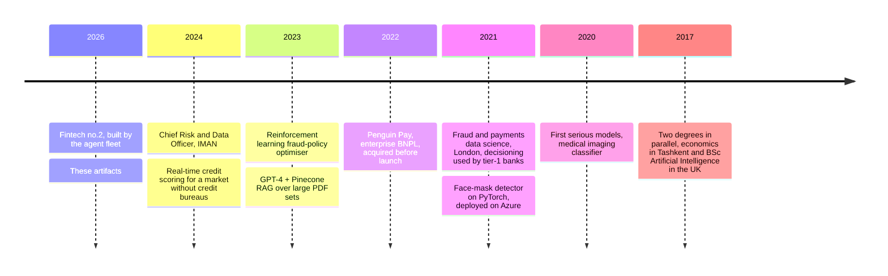

# Shakhzod

Fintech founder. I run my startup on AI agents: they write the code, run the research, maintain the knowledge base, and quiz me on the results. The useful parts get published here.

## Agent artifacts

One artifact per repo, each installable in one line.

| Artifact | What it does |
|---|---|
| [quiz-me](https://github.com/runsagents/quiz-me) | Your agent quizzes you on your repo's recent changes, honest grading. Move fast and still understand what you're shipping |
| [rival-review](https://github.com/runsagents/rival-review) | Every agent-written diff gets attacked by a different model before merge. Same model reviewing itself is homework marking itself |
| [airlocks](https://github.com/runsagents/airlocks) | Trust state, not words. "Merged, deployed, passing" gets checked at the system of record, never grepped from logs |
| [voice-calibration](https://github.com/runsagents/voice-calibration) | Method and template for agent drafts that actually sound like you, calibrated on your own message history |

## How I run the fleet

Most of what I know about agents fits in a few habits. Every agent gets its own worktree and branch, because two writers on one checkout ruin each other's work. A different model reviews every diff, since a model marking its own homework misses its own blind spots. "Done" is never believed, it is checked: the branch, the build number, the store. And the loop matters more than the prompt. The skills, memory files and gates around the model decide more than the words inside it, so that is where the engineering time goes.

## What I've worked on

Newest first. The old ones are still up with their original dates.

In links: [IMAN](https://imanum.app/en) is the fintech where I ran risk and data. [The face-mask detector](https://github.com/runsagents/FaceMaskDetector) is from January 2021. [The RAG chatbot](https://github.com/runsagents/LLM_chatbot) is from June 2023. [The coursework era](https://github.com/runsagents/ML_Portfolio) is labeled as exactly that.

**X: [@runsagents](https://x.com/runsagents)**
